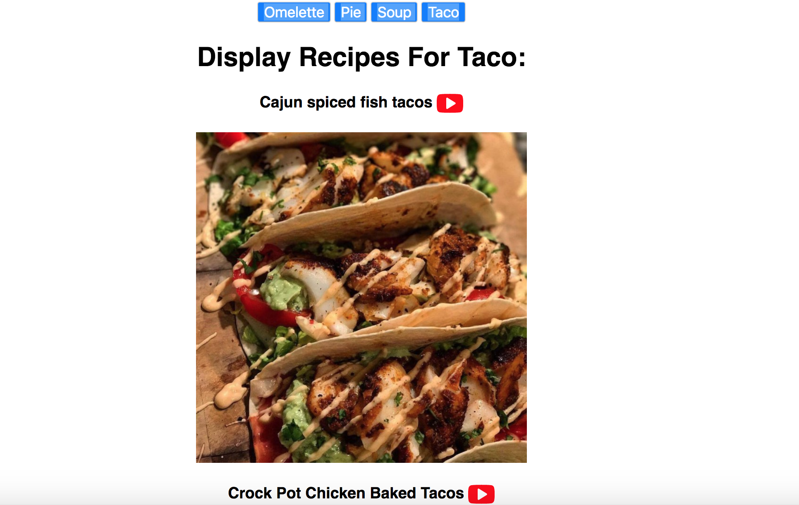

# Intro To React Workshop

This is an Intro to React Workshop.

By the end of the workshop, we will have a simple recipe app:



# Create your first app

First you'll need [node.js](https://nodejs.org/en/) and a JavaScript editor like [vscode](https://code.visualstudio.com/) or [atom](https://atom.io/).

Next, open a terminal and install `create-react-app`:

```sh
npm install -g create-react-app
```

Now we will create our sample recipe app:

```sh
create-react-app recipe-app
```

When it completes, you can run the following to start your app:

```sh
cd recipe-app
npm start
```

Now, your new app will load in your browser!

# Components and Props

Lets take a look at the basic app that was generated for us. In your editor, open `recipe-app/src/App.js`. The app currently looks like this:

```js
class App extends Component {
  render() {
    return (
      <div className="App">
        <div className="App-header">
          
          <h2>Welcome to React</h2>
        </div>
        <p className="App-intro">
          To get started, edit <code>src/App.js</code> and save to reload.
        </p>
      </div>
    );
  }
}
```

Our whole app is in one component, and the render function is at the heart of it. Try modifying some text, save, and watch the app automatically show those changes!

Now lets go ahead and make a new component, `RecipeDispaly`. The render function is the heart of the component because it defines what will be displayed. For now, lets just display a `<div>` HTML tag, with some text inside.

```js
class RecipeDispaly extends Component {
  render() {
    return (
      <div>
        <h1>Display Recipes</h1>
      </div>
    );
  }
}
```

Lets modify our App component to use this new one.

```js
class App extends Component {
  render() {
    return (
      <div className="App">

        <RecipeDispaly name="Omelette" />

      </div>
    );
  }
}
```

As you can see, we are passing data into `RecipeDispaly`. This data is a prop, called "name". We can modify our component to display the data being passed in:

```js
class RecipeDispaly extends Component {
  render() {
    return (
      <div>
        <h1>Display Recipes For {this.props.name}: </h1>
      </div>
    );
  }
}
```

Near the top of the file, lets add some different Food Item that we might want Recipes for:

```js
const FoodItem = [
  { name: 'Omelette' },
  { name: 'Pie' },
  { name: 'Soup' },
  { name: 'Taco' }
];
```

Now, upgrade the App's render function to iterate over each Food Item, and render a `<button>` tag for it.

```js
return (
  <div className="App">

    <RecipeDispaly name="Omelette" />

    {
      FoodItem.map((item, index) => (
        <button
          key={index}
          onClick={() => console.log(index)}
        >
          {item.name}
        </button>
        )
      )
    }
  </div>
);
```

We are creating an array of `n` elements for it, and the `key` prop is used to tell React what is the order of the elements in the array.

# State

We want our app to be able to switch between places, so we can use state to keep that data in our App component.

First, lets add a constructor function that will use the normal class `super` function, and then set up the initial `this.state`:

```js
constructor(props) {
  super(props);
  this.state = {
    currentFoodRecipes: 0
  }
}
```

Our `render` function can use the data from `this.state` when declaring the UI. To change state, we can use the React component's `setState` method, which will change the state and re-run the render function to get the new UI.

Let's use the `this.state` and `this.setState` in our App component:

```js

class App extends Component {
  
  constructor(props) {
    super(props);
    this.state = {
      currentFoodRecipes: 0
    }
  }

  render() {
    //Destructuring
    return (
      <div className="App">

        {
          FoodItem.map((item, index) => (
            <button
              key={index}
              onClick={() => this.setState({ currentFoodRecipes: index })}
            >
              {item.name}
            </button>
            )
          )
        }

        <RecipeDispaly key={this.state.currentFoodRecipes} name={FoodItem[this.state.currentFoodRecipes].name} />
      </div>
    );
  }
}
```

# Lifecycle Methods and Data Fetching

The [lifecycle methods](https://facebook.github.io/react/docs/react-component.html#the-component-lifecycle) of a React component allows us to write additional code for these cases.

In this example, we want to make an API call when the component first shows up on screen, so we will add code to `componentDidMount`. Lets update the `RecipeDispaly` component to the following:

```js
class RecipeDispaly extends Component {
  
  constructor(props) {
    super(props);
    this.state = {
      recipes: null
    }
  }

  componentDidMount() {
    const name = this.props.name;
    //sample api query - https://www.themealdb.com/api/json/v1/1/search.php?s=Omelette
    const url = 'https://www.themealdb.com/api/json/v1/1/search.php?s='+name;
    fetch(url)
      .then(
        response => response.json())
      .then(data => this.setState({ recipes: data.meals }))
  }

  render() {
    const recipes = this.state.recipes;
    return (
      <div>
        <h1>Display Recipes For {this.props.name}: </h1>

        {
          recipes && recipes.map((recipe, index) => (
            <div key={index}>
              <h3>{recipe.strMeal} <a href={recipe.strYoutube} target='_blank'><YoutubePlay size={32}/></a> </h3>
              
              
            </div>
          ))
        }
      </div>
    );
  }
}
```

# Resources and other topics

- [React](reactjs.org) - Official Documentation
- [React Native](https://facebook.github.io/react-native/) - Use the same techniques to build mobile apps for iOS and Android
- [Redux](http://redux.js.org/) - Manage data in large applications when props become tedious
- [Jest](https://facebook.github.io/jest/) - Test framework for JS
- [Flow](https://flow.org/) - Static type checker for JS
